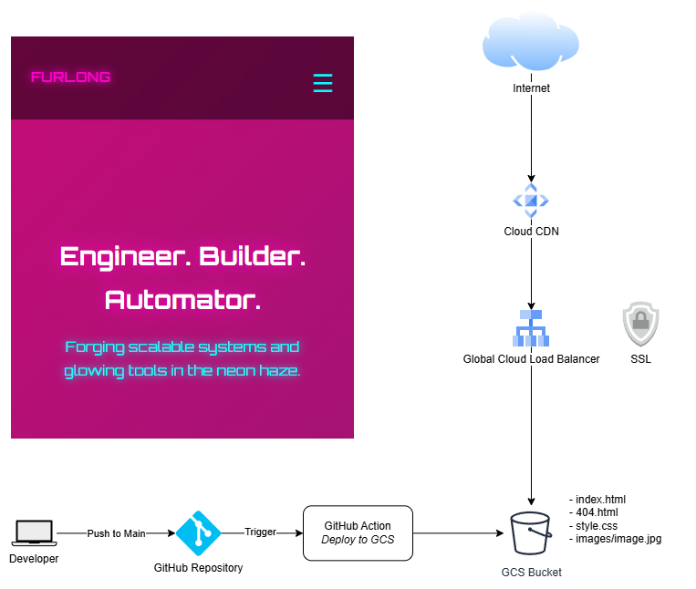

# Jake Furlong — Personal Homepage

This is my personal, static website built with HTML, CSS, and a neon-styled cyberpunk aesthetic. It showcases my projects, contact links, and a bit about who I am. The site is designed to be fast, responsive, and visually distinct — built from scratch without frameworks or server-side code.

https://jakefurlong.io

---

## ✨ Features

- **Responsive design** — mobile-first layout with adaptive scaling
- **Neon cyberpunk theme** — custom animations, glows, and gradients
- **Client-side only** — no JS frameworks, no build tools
- **Hosted on Google Cloud Storage** with optional Cloud CDN
- **GitHub Actions CI/CD** workflow to push to GCS on commit

---

## 🛠️ Tech Stack

- **HTML5 + CSS3** (Orbitron font, flexbox/grid)
- **JavaScript** (only for interactivity, e.g., nav menu toggle)
- **GitHub Actions** for continuous deployment
- **Google Cloud Storage** as the hosting backend
- **Cloud Load Balancer** to provide SSL and global availability with CDN

---

## 🚀 Deployment

This site is automatically deployed via GitHub Actions to Google Cloud Storage.

gcloud storage cp index.html gs://jakefurlong.io \
  --cache-control="no-cache, max-age=0"